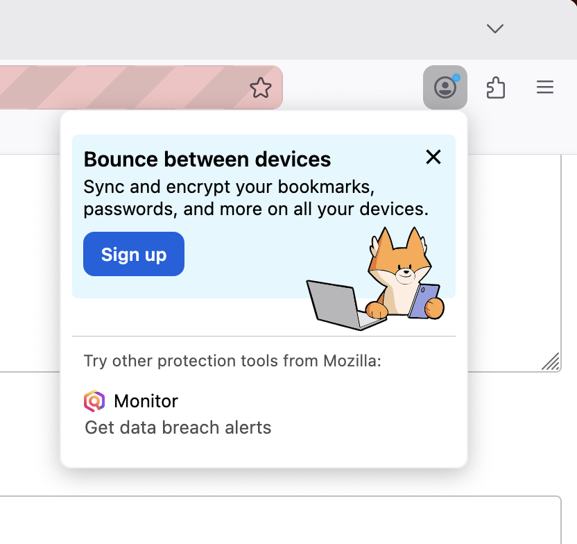

# MenuMessage

MenuMessage displays a contextual call-to-action card inside Firefox's panel menus: the App Menu (hamburger) and the PXI Menu (Firefox Accounts avatar panel).



## Surfaces

| Surface | `testingTriggerContext` | Supported `messageType` |
|---------|------------------------|------------------------|
| App Menu | `app_menu` | `fxa_cta`, `default_cta` |
| PXI Menu | `pxi_menu` | `fxa_cta` only |

## Message Types

- **`fxa_cta`**: Firefox Accounts sign-in prompt. Hidden for signed-in users unless `allowWhenSignedIn: true`. Available in both the App Menu and PXI Menu.
- **`default_cta`**: General CTA. App Menu only. Always shown regardless of sign-in state.

## Layouts

- **`column`** (default): Illustration above text with a button stack below.
- **`row`**: Text on the left, button and illustration on the right.
- **`simple`**: Single row with primary text and button only — no image or secondary text.

## Testing Menu Messages

### Via the dev tools:
1. Set `browser.newtabpage.activity-stream.asrouter.devtoolsEnabled` to `true` in `about:config`
2. Go to `about:asrouter`
3. Select `panel` as the provider and find messages with `"template": "menu_message"`
4. Click **Show** — the `testingTriggerContext` field on the message determines which menu surface is simulated
5. Paste custom JSON in the text area and click **Modify** to preview changes

### Via Experiments:
[Messaging Journey](https://experimenter.info/messaging/desktop-messaging-journey)

## Example JSON

### PXI Menu — `fxa_cta` with row layout

```json
{
  "id": "FXA_ACCOUNTS_PXIMENU_ROW_LAYOUT",
  "template": "menu_message",
  "content": {
    "messageType": "fxa_cta",
    "layout": "row",
    "primaryText": "Bounce between devices",
    "secondaryText": "Sync and encrypt your bookmarks, passwords, and more on all your devices.",
    "primaryActionText": "Sign up",
    "primaryAction": {
      "type": "FXA_SIGNIN_FLOW",
      "data": {
        "where": "tab",
        "extraParams": {
          "utm_source": "firefox-desktop",
          "utm_medium": "product",
          "utm_campaign": "some-campaign",
          "utm_content": "some-content"
        },
        "autoClose": false
      }
    },
    "closeAction": {
      "type": "BLOCK_MESSAGE",
      "data": {
        "id": "FXA_ACCOUNTS_PXIMENU_ROW_LAYOUT"
      }
    },
    "imageURL": "chrome://browser/content/asrouter/assets/fox-with-devices.svg",
    "imageWidth": 100,
    "imageVerticalTopOffset": -4,
    "imageVerticalBottomOffset": -32,
    "containerVerticalBottomOffset": 20
  },
  "trigger": { "id": "menuOpened" },
  "testingTriggerContext": "pxi_menu"
}
```

### App Menu — `default_cta` with simple layout

```json
{
  "id": "APP_MENU_DEFAULT_CTA_EXAMPLE",
  "template": "menu_message",
  "content": {
    "messageType": "default_cta",
    "layout": "simple",
    "primaryText": "Try Firefox Relay",
    "primaryActionText": "Learn more",
    "primaryAction": {
      "type": "OPEN_URL",
      "data": {
        "args": "https://relay.firefox.com/",
        "where": "tab"
      }
    },
    "closeAction": {
      "type": "BLOCK_MESSAGE",
      "data": {
        "id": "APP_MENU_DEFAULT_CTA_EXAMPLE"
      }
    }
  },
  "trigger": { "id": "menuOpened" },
  "testingTriggerContext": "app_menu"
}
```

## Schema

[MenuMessage.schema.json](https://searchfox.org/mozilla-central/source/browser/components/asrouter/content-src/templates/OnboardingMessage/MenuMessage.schema.json)

## Related Docs

- [Targeting attributes](https://firefox-source-docs.mozilla.org/toolkit/components/messaging-system/docs/targeting-attributes.html)
- [Triggers](https://firefox-source-docs.mozilla.org/toolkit/components/messaging-system/docs/TriggerActionSchemas/index.html)
- [Special Message Actions](https://firefox-source-docs.mozilla.org/toolkit/components/messaging-system/docs/SpecialMessageActionSchemas/index.html)
