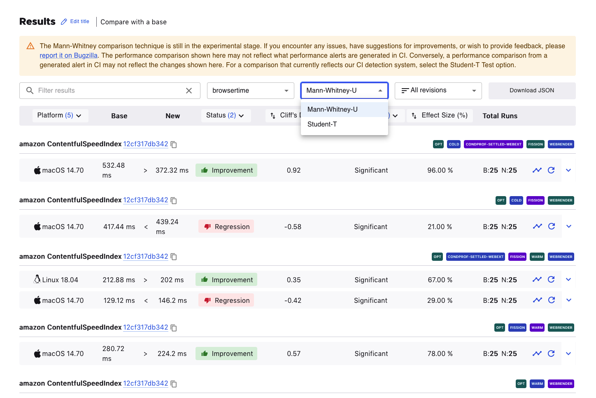
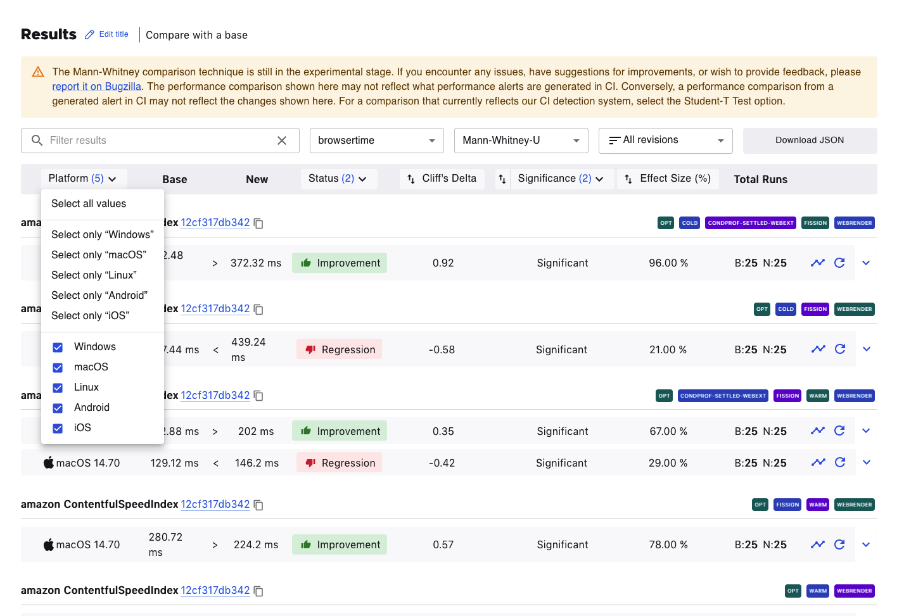
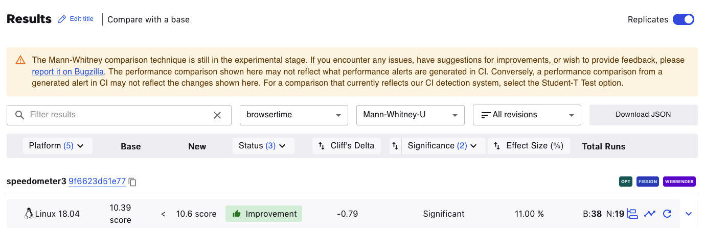
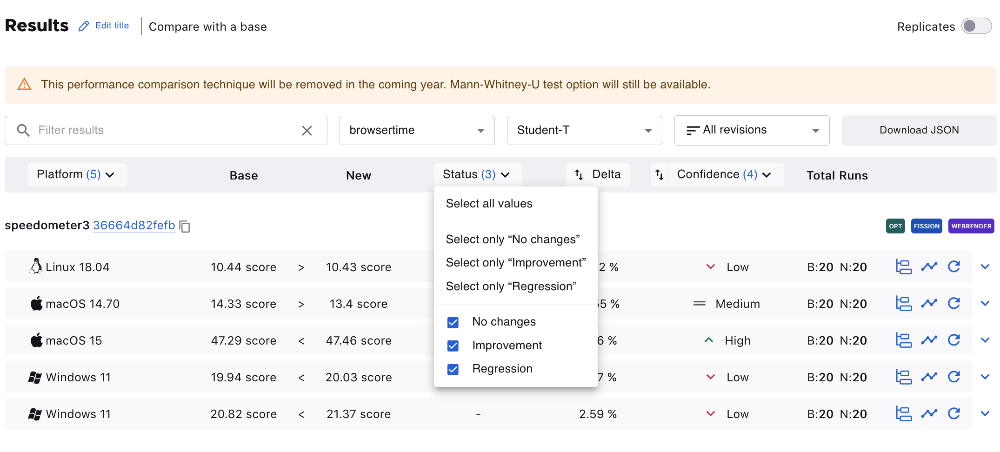
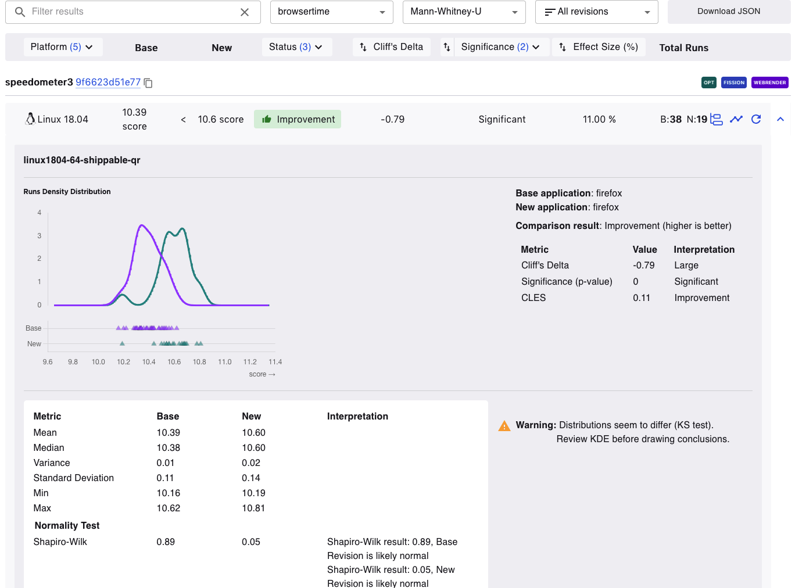
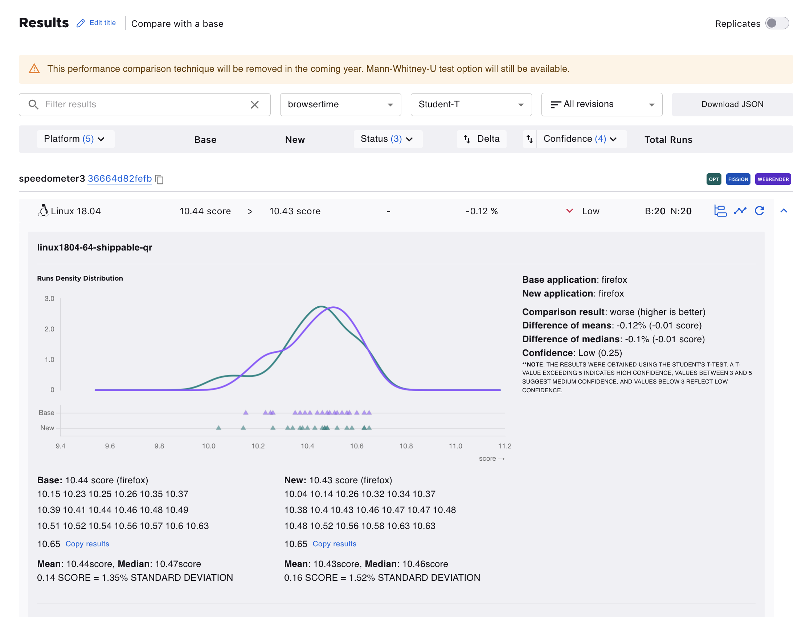
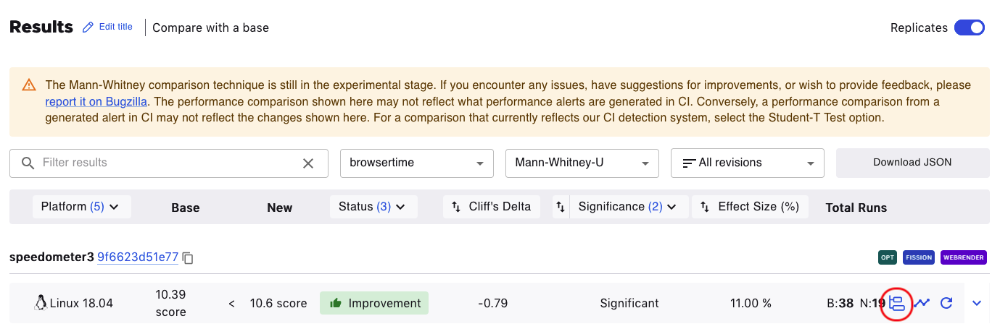

=============
PerfCompare
=============

.. contents::
		:depth: 5
		:local:

PerfCompare is an improved performance comparison tool that replaced Perfherder's Compare View. It allows comparisons of up to three **new** revisions/patches versus the **base** revision of a repository (mozilla-central, autoland, etc). Up to three **new** revisions compared to the **base** repository’s history over time can be selected. The two comparison workflows lead to results indicating whether patches have caused an improvement or regression. The following documentation captures the app’s features and workflows in more detail.

Where can I find PerfCompare?
==============================

Aside from `the perf.compare website <https://perf.compare/>`_, it is accessible on Perfherder’s header under the "Compare" menu option.

The source code can be viewed in this GitHub `repository <https://github.com/mozilla/perfcompare>`_.

Home / Search Page
====================

Landing on PerfCompare, two search comparison workflows are available: **Compare with a base** or **Compare over time**.

Compare with a base
--------------------

 .. image:: ./perfcomparehomescreen.png
   :alt: PerfCompare Interface with Three Selected Revisions to Compare with a Base
   :scale: 50%
   :align: center

PerfCompare allows up to three **new** revisions to compare against a **base** revision. The specific testing framework or harness can also be selected.

Compare over time
------------------

It’s also possible to select up to three revisions to compare against a base repository’s history over a specified period.

 .. image:: ./compareovertime.png
   :alt: PerfCompare Selection Interface for Revisions/Pushes to Compare over Time
   :scale: 50%
   :align: center

Results Page
=============

After pressing the Compare button, the Results Page displays the information of the selected revisions and the results table.

Edit the compared revisions
----------------------------

The compared revisions can be edited, and a new comparison can be computed for an updated results table without having to return to the home page. Clicking the **Edit entry** button will open the edit view.

 .. image:: ./resultseditentry.png
   :alt: PerfCompare Results Page Edit Entry Selection
   :scale: 50%
   :align: center

In the edit view, it’s possible to search for revisions or delete selected revisions. The option to cancel and return to the previous selections is available. Otherwise, once satisfied with the changes, clicking **Compare** will update the data in the results table.

.. image:: ./resultseditentryviewbase.png
   :alt: PerfCompare Results Page Compare with a Base Edit Entry View
   :scale: 50%
   :align: center

Like Compare with a base, clicking **Edit Entry** will open the edit view to change selections for the base repository, time range or to delete or search for new selected revisions.

.. image:: ./resultseditentryviewtime.png
   :alt: PerfCompare Results Page Compare over Time Edit Entry View
   :scale: 50%
   :align: center

Results Table
==============

Edit title
----------

Clicking the **Edit title icon** allows changing the title of the results table.

Search the results | Frameworks Dropwdown | All Revisions Dropdown
------------------------------------------------------------------

It’s possible to search the results table by platform, title, revisions, or options. It’s also possible to search with multiple words (all must match). Use **-word** to exclude results containing that word. In the frameworks dropdown, other frameworks can be selected to see the results in a different test harness. The **All revisions** dropdown provides options to see the results according to a specific new revision.

Test Version Dropdown
---------------------

The default statistical technique for PerfCompare is `Mann-Whitney-U <https://en.wikipedia.org/wiki/Mann%E2%80%93Whitney_U_test>`_, recently changed from Student-T, which is still available for selection in the test version dropdown. Student-T will be removed from the platform in the coming year.

The **Download JSON** button generates a JSON output of the results data.

Mann-Whitney-U Columns
----------------------

Platform
--------

Clicking on the Platform column title allows filtering the results according to the preferred platform.

Status
------

The results are filterable by status. An improvement or regression being shown here means that the effect size is meaningful.

Cliff’s Delta
-------------

`Cliff’s Delta <https://en.wikipedia.org/wiki/Effect_size#Effect_size_for_ordinal_data>`_ measures the magnitude of the difference between the Base and New values by providing a standardized, unitless metric. For example, in the image below, the Cliff’s Delta is -0.79. This means it is a large effect (anything beyond ±0.47 is considered a large difference). The negative value means a New value is consistently larger than a Base value.

| Cliff’s delta:
| < 0.15 →   Negligible difference
| < 0.33 →   Small
| < 0.47 →   Moderate
| ≥ 0.47 →   Large difference
|

Significance
------------

Significance of the comparison as determined by a Mann Whitney U test. A significant comparison has a p-value of less than 0.05.

Common Language Effect Size (CLES)
----------------------------------

`The Common Language Effect Size (CLES) <https://en.wikipedia.org/wiki/Probability_of_superiority>`_ is a standardized measure that quantifies the magnitude of the difference between two groups, unlike a p-value which only determines if an effect is statistically significant. While a statistically significant difference can be practically irrelevant, the effect size provides a clearer indication of how large or meaningful the change is. This unitless metric helps developers differentiate between an effect that is non-existent, small, or substantial, informing decisions on which performance changes to validate further. If the effect size is close to 50%, the distributions are probably identical, if not, they probably differ. In the example below, the effect size is 11% which means there’s a lot of variability within the Base and New values.

Student-T Columns
-----------------

The results table can be filtered according to Platforms, Status (No Changes, Improvement, or Regression), or Confidence (Low, Medium, High).

Expanded Rows
-------------

Clicking on the **the caret-down** button expands the row and provides graphs and interpretation of the values. Hovering over the points or curve on the graphs shows more information about it.

Mann-Whitney-U Expanded Row
---------------------------

Student-T Expanded Row
----------------------

Subtests
--------

When such data is available, clicking on the **subtest icon** opens a new page containing the information about the subtests for the selected result

.. image:: ./resultstablesubtests.png
   :alt: PerfCompare Results Table with Subtests View
   :scale: 50%
   :align: center

Graph view
----------

Clicking on the **graph icon** opens the graph of the historical data or graph view for the job in a new window on Treeherder.

.. image:: ./resultstableexpandedgraph.png
   :alt: PerfCompare Results Table with Graph View
   :scale: 50%
   :align: center

Here is an example of the graph view after clicking this icon:

.. image:: ./resultstablegraphviewperfherder.png
   :alt: Historical Graph Data on Perfherder
   :scale: 50%
   :align: center

Retrigger test jobs
===================

It’s possible to retrigger jobs within Taskcluster. Clicking on the **retrigger icon** will show a dialog to choose how many new runs should be started. Note that signing in with valid taskcluster credentials is required.

.. image:: ./resultstableretrigger.png
   :alt: PerfCompare Results Table with Taskcluster Login
   :scale: 50%
   :align: center

.. image:: ./resultstableretriggerjobs.png
   :alt: PerfCompare Results Table with Retrigger Jobs Dialog
   :scale: 50%
   :align: center
